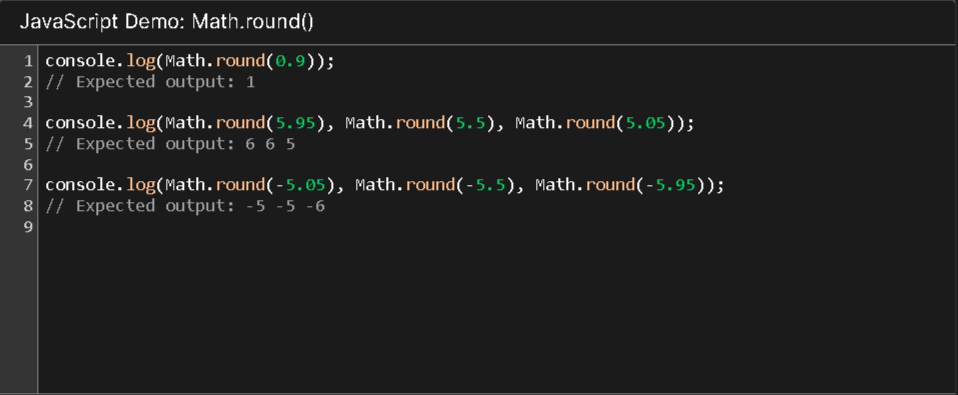
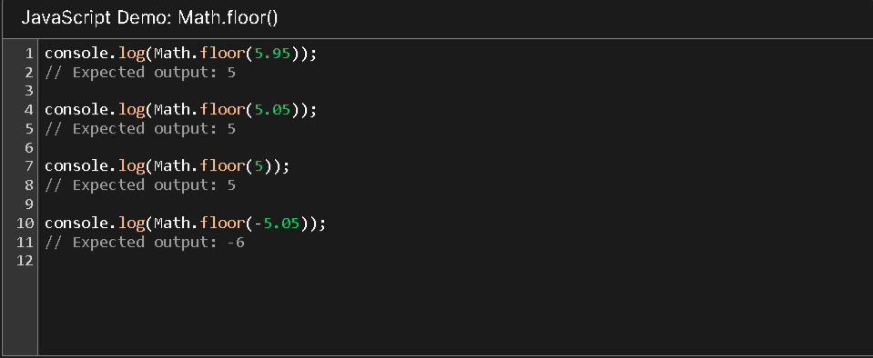
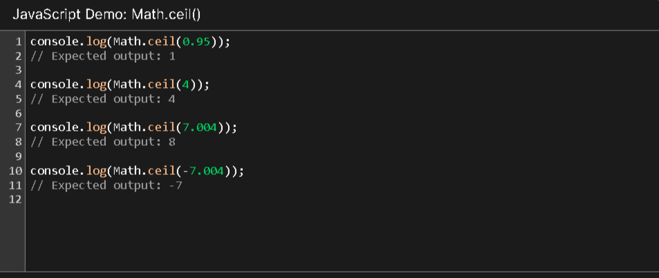
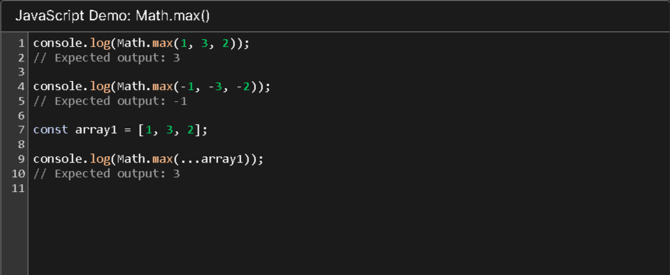
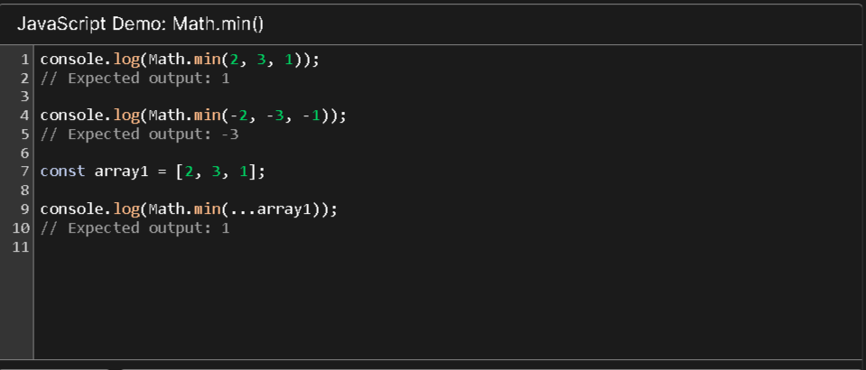
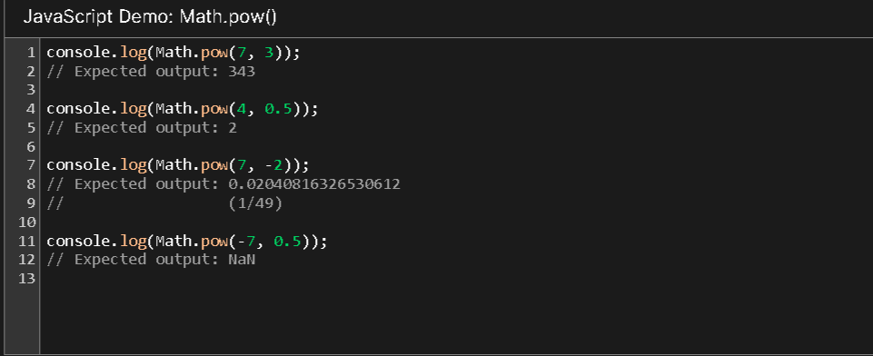
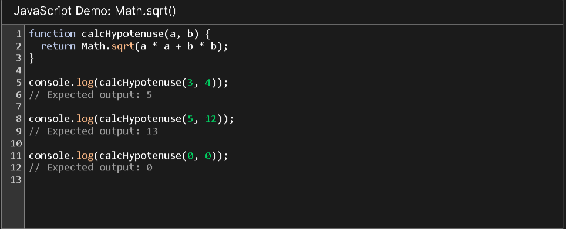
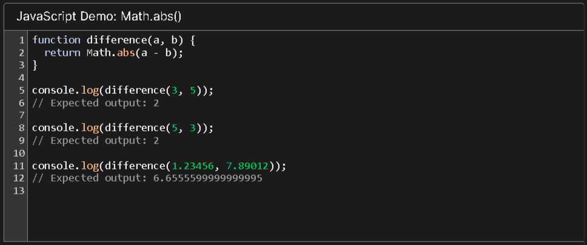
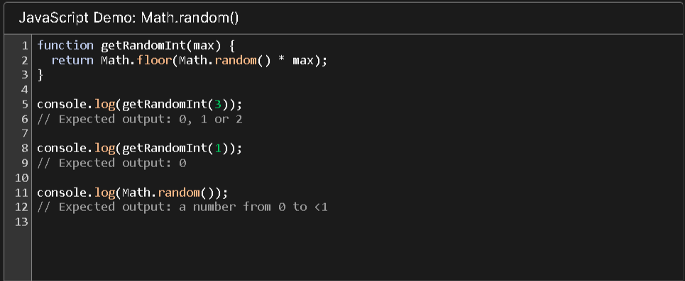
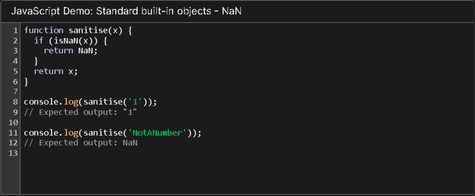

## Javascript Method Number

## Method Math.round()
### Math.round() Статический метод возвращает значение числа, округленное до ближайшего целого числа.

## Method Math.floor()
### Math.floor() Статический метод всегда округляет в меньшую сторону и возвращает наибольшее целое число, меньшее или равное заданному числу.

## Method Math.ceil()
### Math.ceil() Статический метод всегда округляет в большую сторону и возвращает наименьшее целое число, большее или равное заданному числу.

## Method Math.max()
### Math.max()Статический метод возвращает наибольшее из чисел, заданных в качестве входных параметров, или -Infinity, если параметров нет.

## Method Math.min()
### Math.min()Статический метод возвращает наименьшее из чисел, заданных в качестве входных параметров, или Infinity если параметров нет.

## Method Math.pow()
### Math.pow() Статический метод возвращает значение основания, возведенное в степень. То есть

## Method Math.sqrt()
### Math.sqrt() Статический метод возвращает квадратный корень из числа.

## Method Math.abs()
### Math.abs() Статический метод возвращает абсолютное значение числа

## Method Math.random()
### Math.random() Статический метод возвращает псевдослучайное число с плавающей запятой, которое больше или равно 0 и меньше 1, с приблизительно равномерным распределением по этому диапазону, которое затем вы можете масштабировать до желаемого диапазона. Реализация выбирает начальное значение для алгоритма генерации случайных чисел; оно не может быть выбрано или сброшено пользователем.

## Method Math.NaN()
### NaN Глобальное свойство - это значение, представляющее не число.
